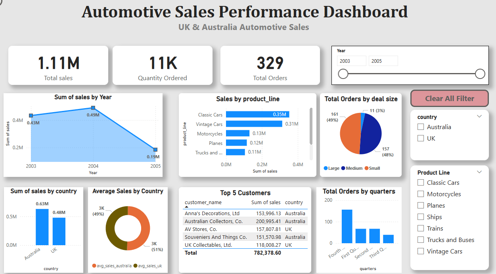

# powerbi-automotive-sales-dashboard
Automotive sales analysis dashboard built in Power BI (UK &amp; Australia).

## Overview
This Power BI dashboard analyzes automotive sales performance across the UK and Australia, focusing on revenue trends, order distribution, product performance, and customer insights.

## Business Questions Answered
- How do total sales change year over year?
- Which product lines generate the highest revenue?
- How do sales compare between the UK and Australia?
- What is the distribution of orders by deal size?
- Who are the top-performing customers?

## Dataset
Automotive sales dataset containing:
order_number
quantity_ordered
price_each	
order_linenumber
sales	
order_date
month	qtr_id
month_id
year_id	
product_line
msrp	
product_code
customer_name	
phone
address_line1	
address_line2	
city
state
postal_code
country	
territory
contact_lastname	
contact_firstname
deal_size

## Tools Used
- Power BI
- DAX
- Excel / CSV

## Data Cleaning Process
data is cleaned in Excel
- columns were renamed to have a standard column name
- Data was checked for null values
- order date format is changed from string to Date
- month and quarter Id were given in numerical value - changed to descriptive words eg: 1 to January, 4 to Fourth Quarter
- state column had a lot of null values using the conditional forumla changed the null to other states

## Key KPIs
- Total Sales: 1.11M
- Quantity Ordered: 11K
- Total Orders: 329

## Dashboard Preview

## Key Insights
- Australia generates higher total sales compared to the UK
- Sales peaked in 2004 and declined in 2005
- Classic Cars and Vintage Cars are the top-performing product lines
- Large and Medium deal sizes account for nearly all orders
- Quarter four records the highest number of orders

## Filters & Interactivity
- Year range slider
- Country slicer (UK, Australia)
- Product line selection
- Clear all filters button

## Files
- `automotive_sales_dashboard.pbix` – Power BI report
- `cleaned_sales_data.csv` – Prepared dataset

